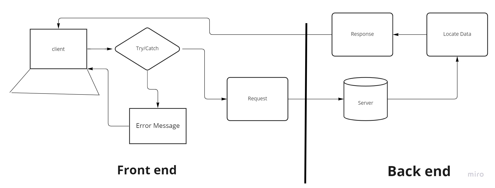

# City Explorer

**Author**: Scottie Houghton
**Version**: 1.0.0 (increment the patch/fix version number if you make more commits past your first submission)

## Overview
A server to store weather data that can be requested by the City Explorer application.

<!-- Provide a high level overview of what this application is and why you are building it, beyond the fact that it's an assignment for this class. (i.e. What's your problem domain?) -->

## Getting Started
Express JS, dotenve and nodemon.

<!-- What are the steps that a user must take in order to build this app on their own machine and get it running? -->

## Architecture
* A server built using Express JS.
<!-- Provide a detailed description of the application design. What technologies (languages, libraries, etc) you're using, and any other relevant design information. -->

## Change Log
* 06-21-2022 11:30pm - Application now has a fully-functional express server, with a GET route for the location resource.

<!-- Use this area to document the iterative changes made to your application as each feature is successfully implemented. Use time stamps. -->

## Credit and Collaborations
* Lab 07 Partner: Matthew Larkin

<!-- Give credit (and a link) to other people or resources that helped you build this application. -->

## Lab: Class 07 - Custom Servers with Node and Express

Estimate of time needed to complete: 3 hours

Start time: 8:00pm

Finish time: 11:00pm

Actual time needed to complete: 3 hours